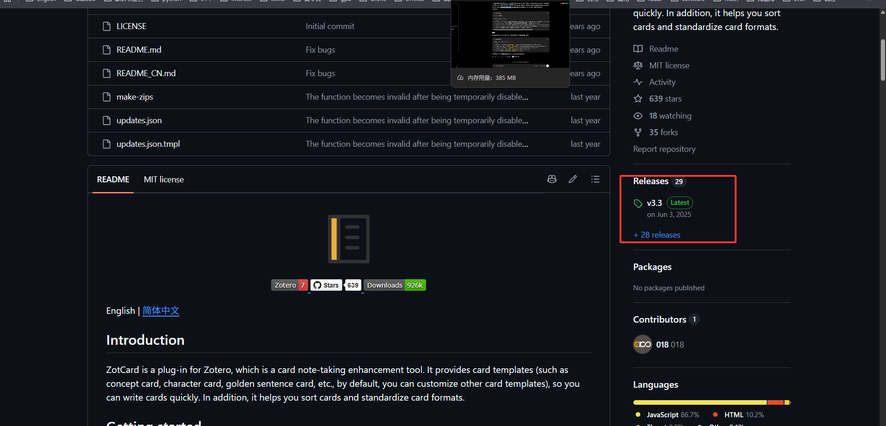
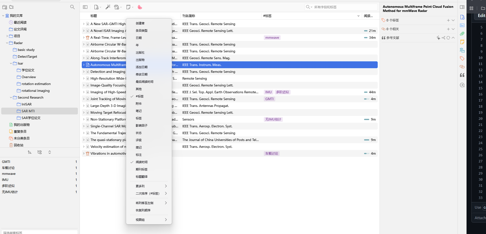

# Zotero
这款软件非常适合阅读英文文献，也适合阅读英文技术手册，包括ti的user_guide.pdf，安装地址为：[zotero下载](https://www.zotero.org/). 只能安装到C区，但建议将数据储存设置放到其他盘，这个可以在`编辑->设置->高级->数据储存设置`中修改，例如`D:\Zotero`。

- 插件下载

| 插件 | 功能简介 | GitHub |
|:----|:---------|:-------|
| Better Notes for Zotero | 功能强大的笔记管理插件，支持双链笔记、Markdown 同步、模板、导出、知识管理等。 | [下载](https://github.com/windingwind/zotero-better-notes) |
| Ethereal Reference | 文献引用增强插件，提供更加便捷的参考文献管理功能。 | [下载](https://github.com/MuiseDestiny/zotero-reference) |
| Ethereal Style | 美化 Zotero 界面，增强阅读体验，提供阅读进度、彩色标签、界面美化等功能。 | [下载](https://github.com/MuiseDestiny/zotero-style) |
| Translate for Zotero | 支持 PDF、EPUB、网页、元数据、批注、笔记等内容翻译，支持多种翻译引擎。 | [下载](https://github.com/windingwind/zotero-pdf-translate) |
| ZotCard | 卡片式阅读与笔记插件，优化阅读及卡片记录体验。 | [下载](https://github.com/018/zotcard) |

下载方式为：点击对应github页面的release进入，如下所示

</img>
  

进去后选择最新版本的Assets中的后缀为.xpi的进行下载。

- 插件安装
  点击`工具->插件->设置->Install Plugin From File`，选择下好的插件文件即可,后缀名为.xpi。

- 文献导入与管理
  
  1.批量导入
  Zotero配置好后，可以通过拖拽实现文件的批量导入。
  
  2. 文献分类
      Zotoro支持新建分类，已导入的文献会在设置的数据储存位置，因此导入后下载的文献可以删除了

  3. 标签管理
     Ethereal Style支持对文献进行打标签管理，只需要在右侧标签处添加`#GMTI`、`多阶近似`等标签，然后如下图选择标题栏即可实现标签管理

</img>
  
