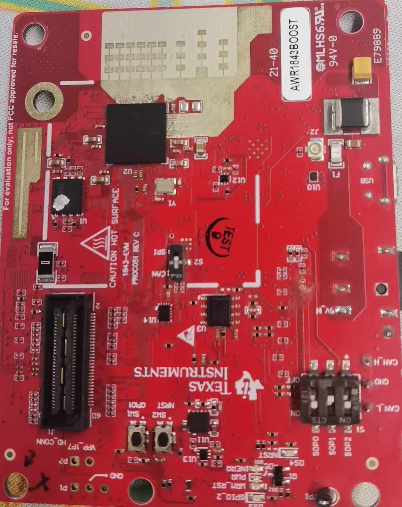
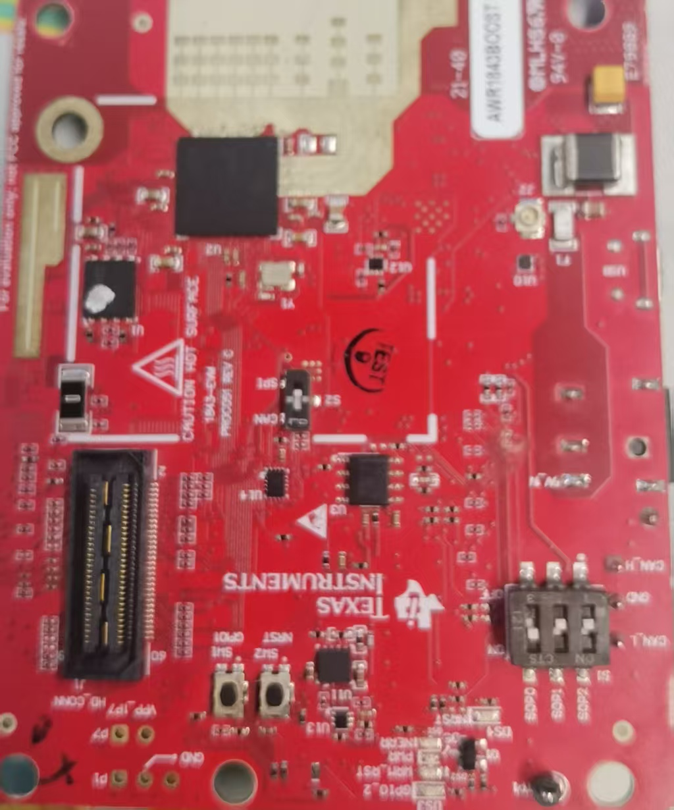
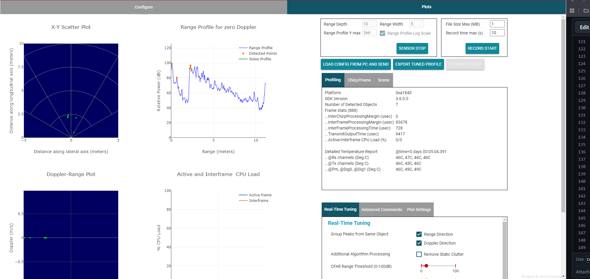

# AWR1843 单板 Out_of_Box 使用教程

## 1. 教程简介

本文档介绍 TI AWR1843 毫米波雷达单板（AWR1843 EVM）的基本开发流程，帮助用户快速完成开发环境搭建、官方 Demo 编译、程序烧录以及运行验证。

本文主要包括以下内容：

- 安装开发环境
- 获取官方 Out of Box (OOB) 工程
- 编译官方 Demo 工程
- 使用 UniFlash 烧录程序到 AWR1843
- 使用 mmWave Demo Visualizer 连接雷达并查看点云、Range Profile 等输出

完成本教程后，用户将能够独立完成 AWR1843 官方 Demo 的编译、烧录及运行。

---

# 2. 开发环境安装

本教程使用的软件版本如下：

| 软件 | 版本 | 说明 | 下载链接 |
|------|------|------|------|
| Code Composer Studio | 12.3.0 | 工程开发与编译 | [安装地址](https://www.ti.com/tool/download/CCSTUDIO/12.3.0) |
|mmwave sdk| 03.06.00.00-LTS | 官方sdk |[安装地址](https://www.ti.com/tool/download/MMWAVE-SDK/03.06.00.00-LTS)|
| mmWave toolbox | 4.00.00.05 | 对应的demo | [安装地址](https://dev.ti.com/tirex/explore/node?isTheia=false&node=A__AEIJm0rwIeU.2P1OBWwlaA__radar_toolbox__1AslXXD__LATEST) |
| mmWave Demo Visualizer | 3.6.0 | 雷达数据显示工具 | [安装地址](https://dev.ti.com/gallery/info/mmwave/mmWave_Demo_Visualizer//) |
| UniFlash | 9.4.0 | 固件烧录工具 | [安装地址](https://www.ti.com/tool/download/UNIFLASH/9.4.0) |
| 串口调试助手 | 无版本 | 串口调试，已有类似软件则不必下 |[点击下载](./串口调试助手.exe)|

toolbox的网址打开后如下图进行下载：
<div align=center></img></div>  

# 3. 获取 Out of Box (OOB) 工程

安装 toolbox 后，官方 Out of Box Demo 已包含在 SDK 中。建议新建一个`ti`的文件夹，将toolbox的文件夹解压在那里。

out_of_box默认路径如下（根据实际安装路径修改）：

```text
radar_toolbox_4_00_00_05\source\ti\examples\Out_Of_Box_Demo\src\xwr1843
```

其中主要工程包括：

- MSS 工程
- DSS 工程

后续将在 CCS 中导入该工程进行编译。

---

# 4. 编译官方 Demo

## 4.1 导入工程
在导入工程前在CCS的目录下创建一个`workspace`文件夹,里面再创建一个`Out_of_box_learn`，文件路径如下
```text
D:\ti\ccs1230\workspace\Out_of_box_learn
```

- 选择Workspace
  打开 CCS：`File → Switch → Others`，选择刚刚创建的文件夹。
- 进行编译
  `File → Import → Code Composer Studio →CCS Projects`，选择刚刚得到的out_of_box的文件夹路径

  导入之后选择mss即可，之后会发现`Project Explorer`中有：` xwr18xx_mmw_demo_mss`和`xwr18xx_mmw_demo_dss`

---

## 4.2 编译工程

之后右键对应的项目，选择`Build Projecrt`，依次编译：

1. DSS 工程
2. MSS 工程

编译成功后将在：

```text
out_of_box_1843_mss\isk
```

目录生成对应的可执行文件及 bin 文件。一般名称是`out_of_box_1843_isk.bin`

---

# 5. 使用 UniFlash 烧录程序

## 5.1 设置雷达启动模式

在烧录前断电，需要将 AWR1843 单板切换至 烧录模式。

<div align=center></img></div>  

完成设置后，重新上电。

---

## 5.2 打开 UniFlash

- 连接设备 启动 UniFlash。选择 AWR1843BOOST
- 选择串口 在`Setting & Utilities`中将COM Port改为User UART的串口号，如下所示
<div align=center></img></div>  

- 烧录程序 在`Program`中，点击第一个Browse添加`out_of_box_1843_isk.bin`
- 烧录 配置完成后点击 **Load Image** 开始烧录。烧录成功后会显示：

```text
[SUCCESS] Program Load completed successfully.
```
---

# 6. 使用 mmWave Demo Visualizer

## 6.1 切换运行模式

烧录完成后断电，将雷达切换至 工作模式。

<div align=center></img></div>  

重新上电。

---

## 6.2 打开 Demo Visualizer

启动 **mmWave Demo Visualizer 3.6.0**。

选择：

- Platform：xWR18xx
- 点击`Options`配置串口，打开设备管理即可找到对应的串口号，波特率使用默认推荐，设置正确后点击 **OK**。

---

## 6.3 运行雷达

点击`SEND CONFIG TO MMWAVE DEVICE`，雷达开始工作。

---

## 6.4 查看数据

运行成功后，可在 `Plots` 中查看对应数据，如图：

<div align=center></img></div>  

至此，官方 Out of Box Demo 已成功运行。
