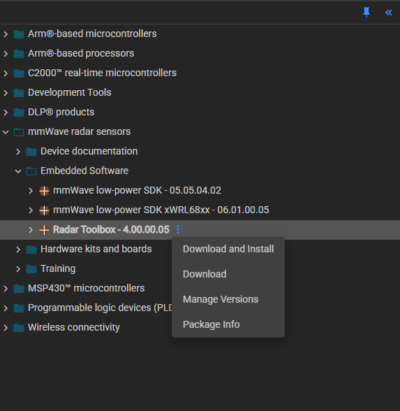

# AWR1843 单板使用教程

## 1. 教程简介

本文档介绍 TI AWR1843 毫米波雷达单板（AWR1843 EVM）的基本开发流程，帮助用户快速完成开发环境搭建、官方 Demo 编译、程序烧录以及运行验证。

本文主要包括以下内容：

- 安装开发环境
- 获取官方 Out of Box (OOB) 工程
- 编译官方 Demo 工程
- 使用 UniFlash 烧录程序到 AWR1843
- 使用 mmWave Demo Visualizer 连接雷达并查看点云、Range Profile 等输出

完成本教程后，用户将能够独立完成 AWR1843 官方 Demo 的编译、烧录及运行。

---

# 2. 开发环境安装

本教程使用的软件版本如下：

| 软件 | 版本 | 说明 | 下载链接 |
|------|------|------|------|
| Code Composer Studio | 12.3.0 | 工程开发与编译 | [安装地址](https://www.ti.com/tool/download/CCSTUDIO/12.3.0) |
| mmWave toolbox | 4.00.00.05 | 官方 SDK | [安装地址](https://dev.ti.com/tirex/explore/node?isTheia=false&node=A__AEIJm0rwIeU.2P1OBWwlaA__radar_toolbox__1AslXXD__LATEST) |
| mmWave Demo Visualizer | 3.6.0 | 雷达数据显示工具 | [安装地址](https://dev.ti.com/gallery/info/mmwave/mmWave_Demo_Visualizer//) |
| UniFlash | 9.4.0 | 固件烧录工具 | [安装地址](https://www.ti.com/tool/download/UNIFLASH/9.4.0) |
| 串口调试助手 | 无版本 | 串口调试 |[点击下载](./串口调试助手.exe)|
toolbox的网址打开后如下图进行下载：
<div align=center></img></div>  
# 3. 获取 Out of Box (OOB) 工程

安装 mmWave SDK 后，官方 Out of Box Demo 已包含在 SDK 中。

默认路径如下（根据实际安装路径修改）：

```text
<mmwave_sdk>\packages\ti\demo\xwr18xx\mmw
```

其中主要工程包括：

- MSS 工程
- DSS 工程

后续将在 CCS 中导入该工程进行编译。

---

# 4. 编译官方 Demo

## 4.1 导入工程

打开 CCS：

File → Import → CCS Projects

选择：

```text
<mmwave_sdk>\packages\ti\demo\xwr18xx\mmw
```

导入完成后可看到：

- xwr18xx_mmw_demo_mss
- xwr18xx_mmw_demo_dss

---

## 4.2 编译工程

依次编译：

1. DSS 工程
2. MSS 工程

编译成功后将在：

```text
Debug/
```

目录生成对应的可执行文件及 bin 文件。

---

# 5. 使用 UniFlash 烧录程序

## 5.1 设置雷达启动模式

在烧录前，需要将 AWR1843 单板切换至 **Functional Mode**。

> **此处插入单板拨码开关（SOP）配置图片，并说明各拨码开关位置。**

例如：

- SOP2 = OFF
- SOP1 = ON
- SOP0 = ON

（请根据实际单板型号填写。）

完成设置后，重新上电。

---

## 5.2 打开 UniFlash

启动 UniFlash。

新建工程：

- Device：AWR1843

连接设备后分别添加：

- MSS bin
- DSS bin

配置完成后点击 **Load Image** 开始烧录。

烧录成功后会显示：

```text
Program Load Success
```

---

# 6. 使用 mmWave Demo Visualizer

## 6.1 切换运行模式

烧录完成后，将雷达切换至 **Functional Mode**。

> **此处插入 SOP 拨码开关图片，并说明运行模式配置。**

重新上电。

---

## 6.2 打开 Demo Visualizer

启动 **mmWave Demo Visualizer 3.6.0**。

选择：

- Platform：AWR1843
- Demo：Out of Box Demo

---

## 6.3 配置串口

连接两个串口：

- CLI Port
- Data Port

设置正确的波特率后点击 **Connect**。

---

## 6.4 加载配置文件

加载 SDK 中提供的配置文件，例如：

```text
profiles\profile_2d.cfg
```

点击：

```text
Send Config
```

雷达开始工作。

---

## 6.5 查看数据

运行成功后，可在 Demo Visualizer 中查看：

- Point Cloud
- Range Profile
- Range-Doppler Heatmap
- Statistics
- Detected Objects

至此，官方 Out of Box Demo 已成功运行。
